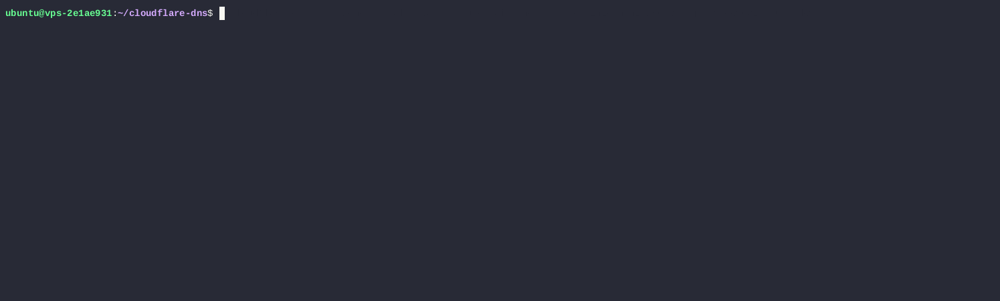

# Cloudflare DNS Updater
Automated Cloudflare DNS updater for dynamic IPs.


## Quick Start
```
# Clone
wget https://raw.githubusercontent.com/naheshi/Cloudflare-DNS-Updater/main/cloudflare-dns.sh
sudo chmod +x cloudflare-dns.sh

# Run
./cloudflare-dns.sh --zone example.com --subdomain mail --token YOUR_CLOUDFLARE_TOKEN
```

| Parameter   | Description                | Example                   |
|------------|---------------------------|---------------------------|
| `ZONE`     | Cloudflare zone name       | `example.com`             |
| `SUBDOMAIN`| Subdomain to update        | `mail`                    |
| `TOKEN`    | Cloudflare API Token       | `YOUR_CLOUDFLARE_TOKEN`  |
